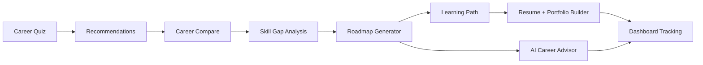

<div align="center">
  
</div>

<div align="center">

# AI Career Navigator

### AI-powered career guidance with fast roadmaps, skill-gap analysis, learning paths, and portfolio-ready output


</div>

## What This Project Does

AI Career Navigator turns career exploration into a guided product flow instead of a disconnected set of forms and APIs.

- Discover roles through quiz-driven guidance and saved career exploration.
- Compare careers and analyze skill gaps against a target role.
- Generate learning roadmaps, personalized plans, and resume or portfolio guidance.
- Track momentum through a dashboard with saved items and generated outputs.
- Run the full stack locally with Docker, PostgreSQL, Spring Boot, FastAPI, and Ollama.

## Experience Flow



## Stack

| Layer | Tech | Responsibility |
| --- | --- | --- |
| Frontend | `Next.js 14`, `TypeScript`, `Tailwind CSS` | Product UI, guided flow, dashboard, forms, generated result views |
| Backend | `Spring Boot`, `JWT`, `JPA/Hibernate` | Auth, API orchestration, persistence, domain logic |
| AI Service | `FastAPI`, `Ollama`, `Pydantic` | Advice, roadmap, skill-gap, learning path, resume generation |
| Database | `PostgreSQL 16` | Users, careers, roadmaps, learning paths, resume portfolios |
| Infra | `Docker Compose` | Local orchestration for all services |

## Core Modules

```text
ai-career-navigator/
  frontend/    Next.js app and UI components
  backend/     Spring Boot API and business logic
  ai-service/  FastAPI inference service and fallback planners
  database/    Schema and seed data
  docker/      Service Dockerfiles
  docs/        API notes and README assets
```

## Quick Start

1. Copy the environment template.

```bash
cp .env.example .env
```

2. Start the full platform.

```bash
docker compose up --build
```

3. Open the apps.

- Frontend: `http://localhost:3000`
- Backend API: `http://localhost:8080/api/v1`
- AI service docs: `http://localhost:8000/docs`

## Fast AI Setup

The AI service is tuned for responsive local development on CPU-first machines.

- Default Ollama model: `qwen2.5:0.5b`
- Short response deadlines with graceful fallbacks
- Roadmap, learning path, resume, and advice routes always return a structured response

On first boot, `ollama-init` pulls the default model automatically. The first startup can still take a little longer because the model image needs to be downloaded.

## API Snapshot

Backend base path: `/api/v1`

- `POST /auth/register`
- `POST /auth/login`
- `GET /careers`
- `GET /careers/{careerId}`
- `GET /careers/compare?careerA={uuid}&careerB={uuid}`
- `POST /ai/career-advice`
- `POST /ai/skill-gap-analysis`
- `POST /roadmaps/generate`
- `POST /learning-paths/generate`
- `POST /resume-portfolio/generate`
- `GET /dashboard`

Detailed endpoint notes live in [docs/api.md](./docs/api.md).

## Why This Repo Feels Good To Work In

- Clear service boundaries between UI, domain API, AI inference, and persistence
- Docker-based local setup that gets the whole platform running quickly
- AI endpoints designed to degrade gracefully instead of hanging forever
- Good foundation for adding auth flows, analytics, portfolio tooling, or richer AI models later

## Local Notes

- If Docker is already running older containers, recreate the stack after changing model settings.
- If Ollama responses are too slow on your machine, keep the lightweight model and short deadlines in `.env`.
- If you want higher quality AI output later, you can increase model size once latency is acceptable.
